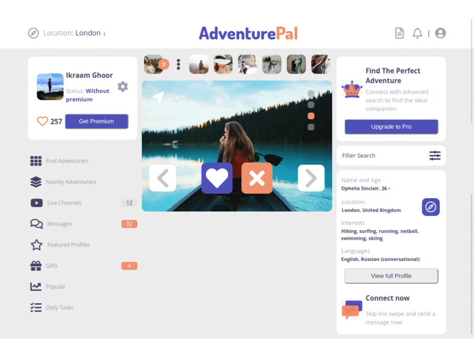

 

# AdventurePal - HTML Capstone Project

*(This project was built within a period of 3 days)*

> A social media concept for matching people who enjoy outside adventures together

[Video of Presentation](https://www.loom.com/share/f2a13e1ed09a4470852bf6f3edbeac7b)

This project was built from a wireframe and a few design images to create a fully coded webpage:

- Three pages were designed, each in mobile and then a desktop version:

1. The person detail [index page](https://ikraamg.github.io/AdventurePal-Social-Media-Concept/index.html) that links to the chat page via the messages icon on the left. Or the picture of the message at the bottom right.

2. The [chat page](https://ikraamg.github.io/AdventurePal-Social-Media-Concept/chats.html), with a list of chats that link to the chat detail page by clicking any chat.

3. The [messages page](https://ikraamg.github.io/AdventurePal-Social-Media-Concept//messages.html) which can be returned from by clicking the left/back arrow on the top left.

- A media query breakpoint was used at 1024px, as requested by the project plan.
- The responsiveness was checked that it did not break on very small or large screens.
- CSS Grid and Flex were used for the layouts.
- SASS was used for styling.

## Built With

- HTML 5
- CSS 3 - Layout with grid and flex

## Live Demo

[Live Demo Link](https://ikraamg.github.io/AdventurePal-Social-Media-Concept/index.html)

## Getting Started

To get a local copy up and running follow these steps:

### Prerequisites

A browser (preferably Chrome)

- Fork/Clone this project to your local machine
- Open index.html in your browser

## Authors

👤 **Ikraam Ghoor**

- Github: [@ikraamg](https://github.com/ikraamg)
- Twitter: [@GhoorIkraam](https://twitter.com/GhoorIkraam)
- LinkedIn: [isghoor](https://linkedin.com/isghoor)
- Email: [consult.ikraam@gmail.com](mailto:consult.ikraam@gmail.com)

## 🤝 Contributing

Contributions, issues and feature requests are welcome!

Feel free to check the [issues page](https://github.com/ikraamg/AdventurePal-Social-Media-Concept/issues)

Start by:

- Forking the project
- Cloning the project to your local machine
- `cd` into the project directory
- Run `git checkout -b your-branch-name`
- Make your contributions
- Push your branch up to your forked repository
- Open a Pull Request with a detailed description to the development(or master if not available) branch of the original project for a review

### 🚀 Potential/Future Features

- Improve demo content
- Refactor SCSS code to remove duplications
- Add more animations
- Add more pages

## Show your support

Give a ⭐️ if you like this project!

## Acknowledgments

- The original design is attributed to [Vlad Ermakov](https://dribbble.com/ermalength), [original design](https://www.behance.net/gallery/70285515/Swipex-This-application-for-dating)

## 📝 License

- The original design is licenced under the [Creative Commons 4.0 licence](https://creativecommons.org/licenses/by-nc-nd/4.0/)

- This project is [MIT](LICENSE.md) licensed
